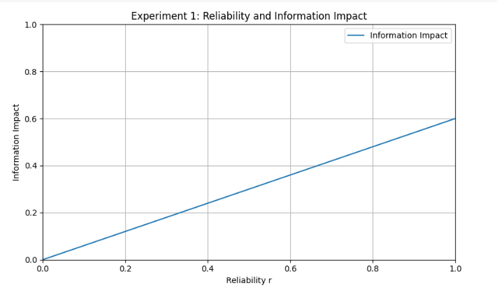
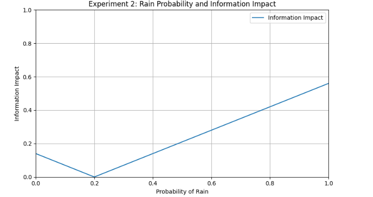

# 情報が人間の行動に与える影響の数理モデル

## 1. 概要

シャノンの情報理論では、ある事象が発生する確率と情報量の関係を

$$
I(x)=-\log_2 P(x)
$$

として表す。

この定義では、発生する確率が低い事象ほど、その事象が発生したことを知ったときに得られる情報量が大きくなる。

一方で、シャノンの情報理論では、その情報が受け手にとってどのような意味を持つのか、また情報を受け取ったことによって受け手の行動がどのように変化するのかについては直接扱わない。

そこで本課題では、情報を受け取った後の「行動」に注目し、情報を以下のように考える。

> **情報とは、受け手がその後に取る行動の確率を変化させるものである。**

この考え方を数理的に表現し、Pythonを用いたシミュレーションによって、情報の内容や情報に対する信頼度が行動にどのような影響を与えるのかを調べる。

具体例として、「天気予報を見た人が傘を持っていくかどうか」という状況を使用する。

---

## 2. 氏名

石井 淳也

---

## 3. 情報に対する考え方

ある人が、天気予報を見る前に傘を持っていこうと考える確率を

$$
P_0
$$

とする。

次に、その人が天気予報から降水確率

$$
P_R
$$

という情報を受け取る場合を考える。

本課題ではモデルを単純化するため、

$$
\boxed{
\text{降水確率}
=
\text{情報を完全に信頼した場合に傘を持つ確率}
}
$$

と仮定する。

例えば、降水確率が80%という情報を完全に信頼した場合、その人が傘を持つ確率も80%になるものとする。

しかし、受け手が得られた情報を常に完全に信頼するとは限らない。

そこで、受け手が情報をどの程度信頼しているのかを表す「信頼度」

$$
r\in[0,1]
$$

を導入する。

ここで、

- \(r=0\)：情報を全く信頼しない
- \(r=1\)：情報を完全に信頼する
- \(0<r<1\)：情報を部分的に信頼する

とする。

---

## 4. 数理モデル

情報を受け取る前の傘を持つ確率 \(P_0\) と、情報を完全に信頼した場合の傘を持つ確率 \(P_R\) の差は、

$$
P_R-P_0
$$

となる。

この差に、受け手の情報に対する信頼度 \(r\) を掛けることで、情報による行動確率の変化を表す。

したがって、情報を受け取った後に傘を持つ確率 \(P_1\) を、

$$
\boxed{
P_1=P_0+r(P_R-P_0)
}
$$

と定義する。

これは、

$$
P_1=(1-r)P_0+rP_R
$$

と書くこともできる。

つまり、情報を受け取った後の行動確率は、

- 元々の行動確率 \(P_0\)
- 受け取った情報 \(P_R\)
- 情報に対する信頼度 \(r\)

の3つによって決定される。

例えば、

$$
P_0=0.2,\qquad
P_R=0.8,\qquad
r=0.5
$$

の場合、

$$
P_1
=0.2+0.5(0.8-0.2)
=0.5
$$

となる。

したがって、情報を受け取ったことによって、傘を持つ確率が

$$
0.2\rightarrow0.5
$$

へ変化したと考える。

---

## 5. 情報の影響度

情報によって受け手の行動がどの程度変化したのかを数値化するため、本課題では「情報の影響度（Information Impact）」を定義する。

情報取得前の行動確率を \(P_0\)、情報取得後の行動確率を \(P_1\) とすると、

$$
\boxed{
I_{\mathrm{impact}}
=
|P_1-P_0|
}
$$

とする。

ここで、

$$
P_1=P_0+r(P_R-P_0)
$$

であるため、

$$
\boxed{
I_{\mathrm{impact}}
=
r|P_R-P_0|
}
$$

と表すことができる。

この式から、情報の影響度は、

1. 受け手がその情報をどの程度信頼しているか
2. 受け取った情報が元々の行動確率とどの程度異なっているか

という2つの要素によって変化すると考えられる。

\(I_{\mathrm{impact}}=0\) の場合、情報を受け取っても行動確率は全く変化していない。

一方、\(I_{\mathrm{impact}}\) が大きいほど、その情報によって受け手の行動確率が大きく変化したことを意味する。

---

## 6. 実験1：情報に対する信頼度の変化

1つ目の実験では、情報に対する信頼度 \(r\) が情報の影響度にどのような影響を与えるのかを調べる。

情報取得前の行動確率 \(P_0\) と降水確率 \(P_R\) を固定し、信頼度 \(r\) を0から1まで変化させる。

### 固定する値

$$
P_0=0.2
$$

$$
P_R=0.8
$$

### 変化させる値

$$
0\leq r\leq1
$$

各信頼度について、

$$
P_1=P_0+r(P_R-P_0)
$$

によって情報取得後の行動確率を計算する。

さらに、

$$
I_{\mathrm{impact}}=|P_1-P_0|
$$

によって情報の影響度を求め、グラフとして可視化する。

これにより、同じ情報を受け取った場合でも、その情報をどの程度信頼するかによって行動への影響が変化することを確認する。

---

## 7. 実験2：降水確率の変化

2つ目の実験では、受け取る情報の内容によって情報の影響度がどのように変化するのかを調べる。

情報取得前の行動確率 \(P_0\) と信頼度 \(r\) を固定し、天気予報によって提示される降水確率 \(P_R\) を0から1まで変化させる。

### 固定する値

$$
P_0=0.2
$$

$$
r=0.7
$$

### 変化させる値

$$
0\leq P_R\leq1
$$

各降水確率について、

$$
P_1=P_0+r(P_R-P_0)
$$

を計算し、

$$
I_{\mathrm{impact}}
=
|P_1-P_0|
$$

によって情報の影響度を求める。

これにより、受け取った情報と元々の行動確率との差が、情報の影響度にどのように関係するのかを調べる。

---

## 8. 実験結果

### 実験1：情報に対する信頼度



実験結果から、信頼度 \(r\) が高くなるほど情報の影響度が大きくなることが確認できる。

\(r=0\) の場合、受け手は情報を全く信頼していないため、

$$
P_1=P_0
$$

となり、

$$
I_{\mathrm{impact}}=0
$$

となる。

一方、\(r=1\) の場合は情報を完全に信頼するため、

$$
P_1=P_R
$$

となり、情報の影響度は最大になる。

---

### 実験2：降水確率



実験結果から、降水確率 \(P_R\) と元々の行動確率 \(P_0\) の差が大きくなるほど、情報の影響度が大きくなることが確認できる。

特に、

$$
P_R=P_0
$$

の場合、

$$
I_{\mathrm{impact}}=0
$$

となる。

これは、受け取った情報が元々の行動傾向と一致している場合、その情報を受け取っても行動確率に変化が生じないことを意味する。

---

## 9. 考察

シャノンの情報理論では、事象の発生確率をもとに情報量を考える。

一方、本課題では情報そのものが持つ情報量ではなく、**その情報を受け取ったことによって受け手の行動がどの程度変化したのか**に注目した。

今回定義した情報の影響度は、

$$
I_{\mathrm{impact}}
=
r|P_R-P_0|
$$

である。

この式から、同じ情報を受け取ったとしても、その情報に対する信頼度が異なれば、行動への影響も異なることが分かる。

つまり、本課題における情報の影響は、情報そのものだけによって決まるのではなく、**情報を受け取る側にも依存する**。

例えば、全く同じ「降水確率80%」という情報を受け取ったとしても、その天気予報を信頼している人と信頼していない人では、傘を持つ確率の変化が異なる。

また、受け取った情報が元々の行動傾向と近い場合には、情報を信頼していたとしても行動への影響は小さくなる。

一方で、本モデルにはいくつかの単純化が含まれている。

特に、「降水確率＝情報を完全に信頼した場合に傘を持つ確率」と仮定しているが、実際の人間の行動はそれほど単純ではない。

実際には、雨の強さ、外出時間、移動手段、傘を持ち歩くことへの負担など、様々な要因によって行動が変化すると考えられる。

また、本モデルでは情報が正しいかどうかについては評価していない。

例えば、誤った情報によって受け手の行動が大きく変化した場合でも、本モデルでは情報の影響度は大きくなる。

したがって、本課題で定義した情報の影響度は、「情報の正しさ」や「情報の有用性」を表しているのではなく、**情報が受け手の行動に与えた変化の大きさを表す指標**である。

---

## 10. 結論

本課題では、情報を

> **「受け手がその後に取る行動の確率を変化させるもの」**

と考えた。

そして、情報取得後の行動確率を

$$
P_1=P_0+r(P_R-P_0)
$$

と定義し、情報による行動確率の変化を表す「情報の影響度」を

$$
I_{\mathrm{impact}}
=
|P_1-P_0|
=
r|P_R-P_0|
$$

と定義した。

Pythonによる実験では、情報への信頼度と降水確率をそれぞれ変化させ、情報の影響度との関係を調べる。

このモデルから、情報の影響は情報そのものだけで決まるのではなく、受け手の元々の行動や、その情報をどの程度信頼しているかによって変化すると考えられる。

この点が、事象の発生確率を中心として情報量を考えるシャノンの情報理論とは異なる、本課題における情報の捉え方である。

---

## 11. 実行方法

### 仮想環境の作成

```bash
python -m venv .venv
```

### 仮想環境の有効化

Windowsの場合：

```bash
.venv\Scripts\activate
```

macOS / Linuxの場合：

```bash
source .venv/bin/activate
```

### 必要なライブラリのインストール

```bash
pip install -r requirements.txt
```

### プログラムの実行

```bash
python main.py
```

プログラムを実行すると、2つの実験が行われ、生成されたグラフが `results` ディレクトリに保存される。

---

## 12. 使用するライブラリ

- Python 3
- NumPy
- Matplotlib
